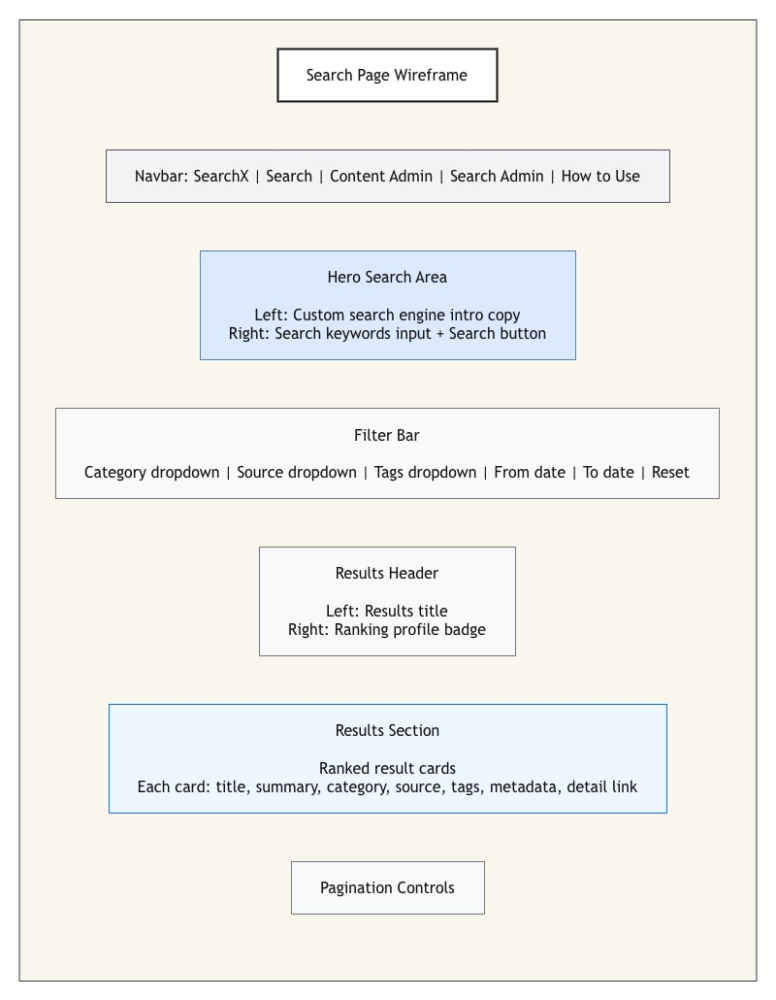

# SearchX Design Document

## Project Description

SearchX is a full-stack search engine and ranking platform where users can search across a large seeded corpus of records. The application simulates how search works inside real software systems. Users can search records, filter results by categories, view ranked search results, and open detail pages. Content admins can create, update, delete, and re-index searchable records. Search admins can tune ranking weights and view high-level app metrics.

## Tech Stack

- Node.js
- Express.js
- Vanilla ES6 JavaScript
- HTML
- CSS
- MongoDB
- Bootstrap

## User Personas

### 1. Search User

A regular user who wants to find relevant records quickly. This user can enter keywords, apply filters, view ranked results, and open record detail pages.

### 2. Content Admin

An admin user who manages the searchable corpus. This user can create, update, delete, and re-index records so that the search system stays accurate and current.

### 3. Search Admin

An admin user who manages search behavior and application-level metrics. This user can tune ranking weights and view app metrics.

## User Stories

1. Keyword Search: As a search user, I want to search by keyword so that I can find relevant records quickly.
2. Ranked Results: As a search user, I want results ranked by relevance so that the most useful records appear first.
3. Search Filters: As a search user, I want to filter results by categories so that I can narrow down the result set.
4. Record Detail Page: As a search user, I want to open a record detail page so that I can inspect the full record information.
5. Create Searchable Records: As a content admin, I want to create new searchable records so that new content becomes available in search.
6. Update Searchable Records: As a content admin, I want to update existing searchable records so that stale or incorrect information can be corrected.
7. Delete Searchable Records: As a content admin, I want to delete records so that removed or invalid records no longer appear in search.
8. Rebuild Search Index: As a content admin, I want to rebuild the search index so that search results stay accurate after content changes.
9. Tune Ranking Weights: As a search admin, I want to tune ranking weights so that I can control how results are ordered.
10. View App Metrics: As a search admin, I want to view app and document metrics so that I can monitor the application.

## Wireframes

The wireframes below show the layout for each public-facing page in the project.

### Search Page

### Record Detail Page
TODO

### Content Admin Page
TODO

### Search Admin Page
TODO

### How to Use Page
TODO