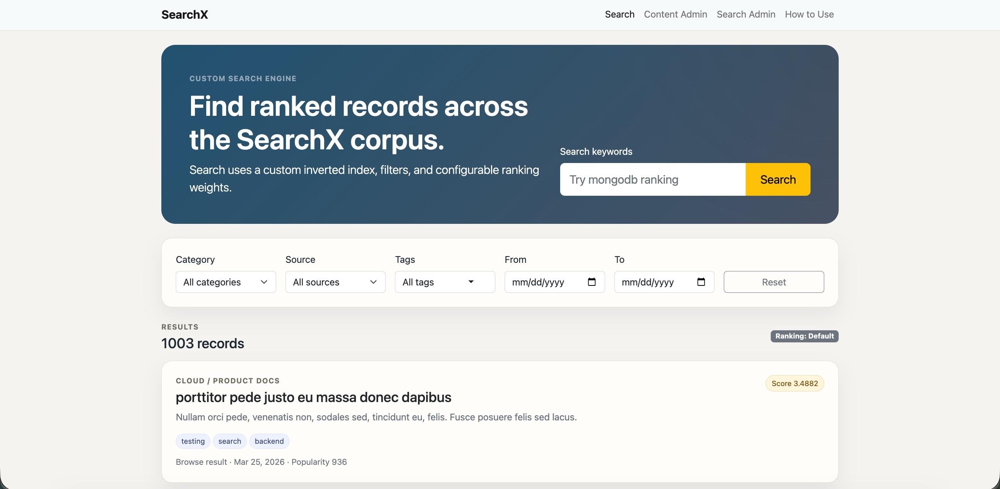

# SearchX

SearchX is a custom search engine and ranking platform built with Node.js, Express.js, MongoDB, vanilla JavaScript, HTML, CSS, and Bootstrap.

Author: Naveen Shankar

Course: Web Development (CS 5610), MS CS at Northeastern University, Boston

Public project page: TODO

Class link: [https://johnguerra.co/classes/webDevelopment_online_summer_2026/](https://johnguerra.co/classes/webDevelopment_online_summer_2026/)

## Project Objective

SearchX is a full-stack search engine and ranking platform where users can search across a large seeded corpus of records. The application simulates how search works inside real software systems. Users can search records, filter results by categories, view ranked search results, and open detail pages. Content admins can create, update, delete, and re-index searchable records. Search admins can tune ranking weights and view high-level app metrics.

## Screenshot



## Build And Run Instructions

TODO

## Design Document

The design document is available in `DESIGN.md`. It includes the required project description,
personas, user stories, design mockups/wireframes/screenshots that explain the portfolio's
layout.

## Demo Video

TODO

## Presentation Slides

Google Slides presentation: https://docs.google.com/presentation/d/1vOY7gIFPHXoTSpVxcU1zUzNGnBWORcoBrkDv2XUmG10/edit?usp=sharing

## GenAI Disclosure

Generative AI was used as an assistant during this project. AI support included designing
wireframes, verifying that the project met the functional requirements, checking the project
against the rubric, and generating and formatting README and presentation materials.

AI was also used to help generate the How To Use page by planning the work in Plan Mode and
then executing that plan in Agent Mode. The project used Cursor IDE with GPT-5.5 models for
complex tasks, Composer 2.5 for subagents, and Composer 2.5 for simple updates.

## License

This project uses the MIT License. See `LICENSE` for details.

## Requirements

- Node.js 20 or newer recommended.
- MongoDB Atlas connection string.
- A `.env` file with:

```bash
MONGODB_URI=your-mongodb-atlas-connection-string
MONGODB_DB=searchx
```

Do not commit `.env`.

## Install

```bash
npm install
```

## Seed The Database

The Mockaroo export should be saved at:

```bash
assets/search-records.json
```

Then run:

```bash
npm run seed
```

The seed command validates that the JSON file has at least 1,000 records, imports the records into MongoDB, creates default ranking profiles, and rebuilds the custom search index.

## Run Locally

Run the Express app:

```bash
npm run dev
```

Open:

```text
http://localhost:3000
```

Optional split frontend workflow:

```bash
npm run dev-frontend
```